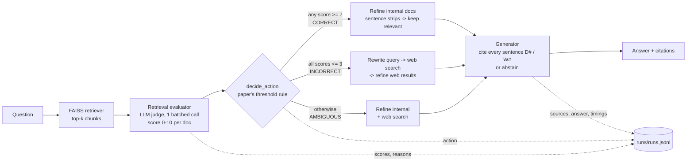

# Corrective RAG (CRAG): an independent reimplementation

This is a from-scratch Python implementation of **Corrective Retrieval-Augmented Generation** (Yan et al., 2024, [arXiv:2401.15884](https://arxiv.org/abs/2401.15884)). It does not wrap LangChain or LangGraph. Every step of the paper's algorithm is a small, readable module. Every run is logged, and an eval harness measures the corrective step against a plain-RAG baseline.

## The paper in plain English

Standard RAG trusts its retriever: whatever the vector search returns is pasted into the prompt, and the LLM answers from it. When retrieval misses (the answer isn't in the knowledge base, or the top hits are on-topic but don't contain the fact), the model either hallucinates or grounds its answer on the wrong document.

CRAG adds a **checkpoint between retrieval and generation**:

1. A lightweight **retrieval evaluator** scores how relevant each retrieved document is to the question.
2. The scores trigger one of three **corrective actions**:
   - **Correct**: at least one doc is confidently relevant. Keep the internal docs, but *refine* them down to the sentences that matter.
   - **Incorrect**: every doc is confidently irrelevant. Throw them away and get knowledge from **web search** instead.
   - **Ambiguous**: the evaluator isn't sure. Use **both** refined internal docs and web results.
3. **Knowledge refinement** ("decompose-then-recompose") splits documents into small strips, drops the irrelevant ones, and stitches the rest back together, so the generator sees signal rather than noise.
4. The generator answers **only from the corrected context**.

## Architecture



| Module | Responsibility |
|---|---|
| [src/crag/store.py](src/crag/store.py) | Load KB markdown into paragraph chunks, embed, FAISS `IndexFlatIP` (cosine) |
| [src/crag/evaluator.py](src/crag/evaluator.py) | Retrieval evaluators (LLM judge, embedding threshold) and the paper's `decide_action` rule |
| [src/crag/refine.py](src/crag/refine.py) | Decompose-then-recompose refinement, web query rewriting |
| [src/crag/websearch.py](src/crag/websearch.py) | Swappable web search: DuckDuckGo (no key), Tavily, or none |
| [src/crag/generate.py](src/crag/generate.py) | Grounded generation with `[D#]`/`[W#]` citations |
| [src/crag/pipeline.py](src/crag/pipeline.py) | `CRAGPipeline`, `PlainRAGPipeline` baseline, wiring |
| [src/crag/llm.py](src/crag/llm.py) | `LLM` protocol with Anthropic and OpenAI adapters |
| [src/crag/runlog.py](src/crag/runlog.py) | Append-only JSONL run log |
| [src/crag/api.py](src/crag/api.py) | FastAPI: `POST /query`, `GET /runs/{id}` |
| [eval/](eval/) | 20 labeled queries, LLM grounding judge, report generator |

The knowledge base ([data/kb/](data/kb/)) is a small set of support articles for a **fictional** product line ("Nimbus"). This is deliberate: the LLM can't know these facts from pre-training. A correct answer to an internal question must come from retrieval, and the eval can tell grounding apart from memorization.

## Design decisions vs. the original paper

| # | Paper | This implementation | Why |
|---|---|---|---|
| 1 | Retrieval evaluator is a **fine-tuned T5-large** (0.77B) scoring each (query, doc) pair in [-1, 1] | **LLM-as-judge** (small, cheap model) scoring all k docs **in one call** on 0-10 | See the evaluator tradeoff below. Batching the k docs into one call cuts round trips by a factor of k. |
| 2 | Two thresholds on evaluator scores choose Correct / Incorrect / Ambiguous | **Same rule** (`decide_action`), thresholds 7 / 3 on a 0-10 scale, configurable | The action logic is the paper's core idea, so it stays exact. Only the scorer is swapped out. |
| 3 | Refinement scores **every strip** with the evaluator and filters by threshold | The LLM **selects strip ids in one call** | One call instead of one per sentence. The model sees all strips together, so it can keep context that a single strip alone would lose. |
| 4 | Web search via Google Search API, query rewritten by ChatGPT, preference for Wikipedia | Query rewritten by the grader LLM; **DuckDuckGo** by default (no API key), Tavily optional, behind a `WebSearch` protocol | No key or billing needed to run. The backend is one line to change. |
| 5 | Generator is Llama-2 / SelfRAG-LLaMA, no citation requirement | Any chat LLM behind an `LLM` protocol; **every sentence must cite `[D#]` or `[W#]`**, or the model abstains | Citations make grounding *checkable*, which the eval harness depends on. |
| 6 | Evaluated on PopQA, Biography, PubHealth, Arc-Challenge | Small **custom eval set** with expected branches, plus a **grounding judge** and **plain-RAG baselines** | The goal is to show that the branching behaves correctly and reduces ungrounded answers, not to reproduce the benchmark numbers. |
| 7 | No mention of observability | **Every run logged**: per-doc score and reason, action, web query, sources, answer, per-stage latency | The pipeline can be inspected and debugged, not just trusted. |

### Retrieval evaluator: the tradeoff

| Approach | Quality | Cost / latency | Effort to build | Main failure mode |
|---|---|---|---|---|
| **A. LLM-as-judge (implemented, default)** | High; reads for the *specific fact*, not just the topic | 1 extra small-model call per query (~hundreds of ms) | Minutes (a prompt) | Prompt sensitivity; API cost at scale |
| B. Embedding-similarity threshold (`EmbeddingThresholdEvaluator`, implemented for comparison) | Low; can't tell "same topic, wrong fact" | Free, instant (reuses retriever scores) | Trivial | Scores on-topic but non-answering docs high |
| C. Fine-tuned small classifier (paper's approach, e.g. T5/DeBERTa cross-encoder) | High *once trained*, and fast at inference | Cheap at inference | Needs thousands of labeled (query, doc, relevance) pairs, plus training and validation | Labeled data doesn't exist for a new domain; drifts when the KB changes |

**Why A:** for a solo, time-boxed build with no labeled relevance data, the LLM judge gets close to the paper's evaluator quality with zero training data. The weakness of B shows up in this project's own data. For *"What does 'IP' stand for in IP68?"*, the top retrieved chunk (Watch 2 water resistance) has cosine similarity 0.57, and for *"Which organization maintains Matter?"* the Home Hub chunk scores 0.58. Both are higher than the top hit for several questions the KB *does* answer (e.g. 0.34 for "Can I swim with Watch 2?"), yet neither contains the answer. A similarity threshold would route that query as Correct. **The path to production is C:** log the LLM judge's grades (already done in `runs.jsonl`), use them as weak labels to distill a small cross-encoder, and swap it in behind the same `RetrievalEvaluator` protocol. The swap costs nothing at the call site.

## Running it

```bash
pip install -e ".[dev]"            # Python 3.11+
cp .env.example .env               # add ANTHROPIC_API_KEY (or OPENAI_API_KEY + CRAG_PROVIDER=openai)

pytest                             # offline tests with a fake LLM; no key needed
python eval/run_eval.py            # full eval -> eval/report.md + eval/results.jsonl
cd src && uvicorn crag.api:app --reload
curl -X POST localhost:8000/query -H "content-type: application/json" \
     -d '{"question": "How do I factory reset my Nimbus Pod X?"}'
```

Configuration is done with `CRAG_*` environment variables (see [src/crag/config.py](src/crag/config.py)): provider, generator/grader models, thresholds, `top_k`, web backend, and embedder (`tfidf` by default, so it runs offline; set `CRAG_EMBEDDER=all-MiniLM-L6-v2` with `pip install -e ".[st]"` for dense embeddings).

## Evaluation

[eval/queries.jsonl](eval/queries.jsonl) holds 20 queries, each with an expected branch and a reference answer:

- **8 "correct"**: answer is in the KB.
- **7 "incorrect"**: answer is not in the KB (general or technical facts). Several are chosen so that retrieval returns *on-topic but wrong* chunks (e.g. Matter, IP ratings), which is the hard case.
- **5 "ambiguous"**: the KB covers part of the answer and the rest needs outside knowledge.

Three pipelines run on the same retriever and generator model:

- `crag`: the full pipeline.
- `plain_rag`: top-k, then generate, using the **same strict prompt** (cite or abstain). This isolates the value of the correction step.
- `plain_rag_naive`: top-k, then generate with a typical tutorial prompt (no abstain instruction). This is how plain RAG is usually deployed.

Metrics (reported in [eval/report.md](eval/report.md)):

| Metric | Definition |
|---|---|
| **Grounded** | The judge splits the answer into atomic claims; grounded means *every* claim is supported by the sources the pipeline actually gave the generator. |
| **Correct** | The answer agrees with the reference answer. |
| **Correct and grounded** | Both. This is the headline, because an abstention is trivially grounded but useless. |
| **Abstained** | The answer declines to answer. Reported so that grounding can't be gamed by refusing. |
| **Branch accuracy** | CRAG's action matches the expected label (3-way). |
| **Web-fallback recall / precision** | Treats {incorrect, ambiguous} as "needs web" and measures routing to web search. |
| **Latency delta** | Mean extra milliseconds per query that the evaluate and correct steps add. |

**Eval caveats (read before quoting numbers):** n = 20, so one query is 5 percentage points; quote rounded numbers along with the set size. The judge is an LLM (by default the same model family as the generator, so self-preference bias is possible), and it checks faithfulness to the provided sources, not truth. "Ambiguous" labels are a judgment call; the "correct vs. needs web" split is the more robust routing metric. Live web results change over time, so runs are not perfectly reproducible.

## Repo layout

```
src/crag/      pipeline code (see module table above)
tests/         offline unit tests (FakeLLM + FakeWeb exercise all three branches and logging)
eval/          queries.jsonl, judge.py, run_eval.py -> report.md, results.jsonl
data/kb/       fictional internal support knowledge base
runs/          JSONL run log (gitignored)
```
